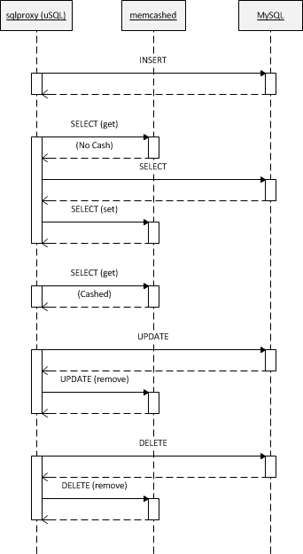

# µSQL for C++

## Examples

µSQL includes the following useful sample applications to know how to use the APIs.

| Sample | Description |
|---|---|
| sqlparse | Simple application to parse SQL statements using µSQL |
| sqlproxy | SQL proxy application for SQL databases such as !MySQL using memcached |
| leveldb | Command line utility for leveldb to operate the database using SQL |

###  sqlparse

The sample is a simple utility to parse input SQL commands. Using the utility, you can see the parsed tree visually as the following.

```
$ ./sqlparse
µSQL> INSERT INTO TESTDB (ID, NAME, ADDR) VALUES (1, "TARO", "TOKYO")
INSERT INTO TESTDB (ID,NAME,ADDR) VALUES (1,"TARO","TOKYO")
|-- INSERT INTO (SQLCommand)
|-- TESTDB (SQLCollections)
| |-- TESTDB (SQLCollection)
|-- (ID,NAME,ADDR) (SQLColumns)
| |-- ID (SQLExpression)
| |-- NAME (SQLExpression)
| |-- ADDR (SQLExpression)
|-- VALUES (1,"TARO","TOKYO") (SQLValues)
| |-- 1 (SQLExpression)
| |-- "TARO" (SQLExpression)
| |-- "TOKYO" (SQLExpression)

µSQL> UPDATE TESTDB SET NAME = "TARO", ADDR = "TOKYO" WHERE ID = 1
UPDATE TESTDB SET NAME = "TARO",ADDR = "TOKYO" WHERE ID = 1
|-- UPDATE (SQLCommand)
|-- TESTDB (SQLCollections)
| |-- TESTDB (SQLCollection)
|-- SET NAME = "TARO",ADDR = "TOKYO" (SQLSets)
| |-- NAME = "TARO" (SQLSet)
| | |-- "TARO" (SQLExpression)
| |-- ADDR = "TOKYO" (SQLSet)
| | |-- "TOKYO" (SQLExpression)
|-- WHERE ID = 1 (SQLWhere)
| |-- ID = 1 (SQLOperator)
| | |-- ID (SQLExpression)
| | |-- 1 (SQLExpression)

µSQL> SELECT * FROM TESTDB WHERE ID = 1
SELECT * FROM TESTDB WHERE ID = 1
|-- SELECT (SQLCommand)
|-- * (SQLColumns)
| |-- * (SQLExpression)
|-- FROM TESTDB (SQLCollections)
| |-- TESTDB (SQLCollection)
|-- WHERE ID = 1 (SQLWhere)
| |-- ID = 1 (SQLOperator)
| | |-- ID (SQLExpression)
| | |-- 1 (SQLExpression)

µSQL> DELETE FROM TESTDB WHERE ID = 1 AND ID = 2
DELETE FROM TESTDB WHERE ID = 1 AND ID = 2
|-- DELETE FROM (SQLCommand)
|-- TESTDB (SQLCollections)
| |-- TESTDB (SQLCollection)
|-- WHERE ID = 1 AND ID = 2 (SQLWhere)
| |-- ID = 1 AND ID = 2 (SQLOperator)
| | |-- ID = 1 (SQLOperator)
| | | |-- ID (SQLExpression)
| | | |-- 1 (SQLExpression)
| | |-- ID = 2 (SQLOperator)
| | | |-- ID (SQLExpression)
| | | |-- 2 (SQLExpression)
```

### sqlproxy

The sample is a command line utility to cash query results of SQL databases such as [MySQL](http://www.mysql.com/) using [memcached](http://memcached.org/). The utility runs as a SQL proxy as the following diagram.


To cash query data using [memcached]([http://memcached.org/), the proxy generates a key for [memcached]([http://memcached.org/) based on the table name and the expressions of the 'where' section in the specified SQL. Using the generated key, the proxy sets or gets the result data when SELECT command is specified, removes the result data when UPDATE or DELETE commands are specified as the following.



The following is an example for using the utility.

```
$ ./sqlproxy -s 192.168.xxx.xxx -u root -d testdb
Server   : 192.168.xxx.xxx
User     : root
Database : testdb
sqlproxy> INSERT INTO TESTDB (ID, NAME, ADDR) VALUES (1, "TARO", "TOKYO")
Done.

sqlproxy> SELECT * FROM TESTDB WHERE ID = 1
[ADDR] = TOKYO
[ID] = 1
[NAME] = TARO
Done.

sqlproxy> SELECT * FROM TESTDB WHERE ID = 1
[ADDR] = TOKYO
[ID] = 1
[NAME] = TARO
Done(Cashed).
```

### leveldb

The sample is a command line utility for [leveldb](http://code.google.com/p/leveldb/) to operate the database using SQL commands like other database systems such as !MySQL and sqlite. The utility runs as a SQL proxy for [leveldb](http://code.google.com/p/leveldb/) as the following diagram.


To execute SQL commands using [leveldb](http://code.google.com/p/leveldb/), the proxy generates a key for leveldb based on the table name and the first expression of the 'where' section in the specified SQL as the following.

| SQL Example| Key for leveldb |
|---|---|
| SELECT * FROM *TESTDB* WHERE *ID = 1* | TESTDB ID = 1 |
| INSERT INTO *TESTDB* (*ID*, NAME, ADDR) VALUES (*1*, TARO, TOKYO) | - |
| UPDATE *TESTDB* SET NAME = "TARO", ADDR = "TOKYO" WHERE *ID = 1* | - |
| DELETE FROM *TESTDB* WHERE *ID = 1* | - |

The following is an example for using the utility to operate [leveldb](http://code.google.com/p/leveldb/) using SQL commands.

```
$ ./leveldb /tmp/testdb
Filename : /tmp/testdb
leveldb> INSERT INTO TESTDB (ID) VALUES (1)
Done.

leveldb> SELECT * FROM TESTDB WHERE ID = 1
[ID] = 1
Done.

leveldb> UPDATE TESTDB SET NAME = "TARO", ADDR = "TOKYO" WHERE ID = 1
Done.

leveldb> SELECT * FROM TESTDB WHERE ID = 1
[ADDR] = TOKYO
[ID] = 1
[NAME] = TARO
Done.
```

## Limitations

µSQL is under development, then it doesn't support all SQL syntax. I will support SQL92, UnQL and GQL finally, but please check [the syntax file of ANTLR](https://github.com/cybergarage/µSQL4CC/blob/master/src/µSQL/parser/antlr/SQL.g) directly if you want to know the current implementation state in more detail.
