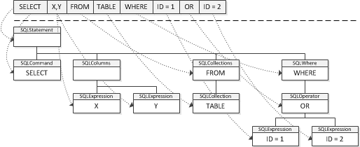
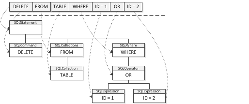

# µSQL for C++

## Introduction

### What is µSQL ?

µSQL is a SQL parser engine for C++ to develop SQL based applications easily, and it supports other SQL like domain specific languages such as [UnQL](http://www.unqlspec.org/display/UnQL/Home) and [GQL]([https://developers.google.com/appengine/docs/python/datastore/gqlreference) too. Because µSQL is written only in old standard C++ library such as STL with [ANTLR]([http://www.antlr.org/]), then you can use it with many C++ compilers and platforms.

### Repository

Please check the following site to get the latest source code and check the doxygen documentation.

- [GitHub](https://github.com/cybergarage/uSQL4CC)
- [Doxygen](http://www.cybergarage.org/doxygen/usql/)

## Getting Started

### System Requirements

To install µSQL, you have to the following package on your platform.  µSQL use the library to run the parser which is generated by [ANTLR](http://www.antlr.org/).

- [ANTLR (C runtime distributions)](http://www.antlr3.org/download/C/)

If you want to compile all examples of µSQL, you have to install the following packages too.

- [Boost (filesystem)](http://www.boost.org/)
- [MySQL (libmysqlclient)](http://www.mysql.com/)
- [leveldb](http://code.google.com/p/leveldb/)
- [libmemcached](http://libmemcached.org/)
- [OpenSSL (libcrypto)](http://www.openssl.org/)
- [libedit](https://sourceforge.net/projects/libedit/)

### Installation

On UNIX platform, you run the following commands to install the header files and library of µSQL. To compile the examples too, please add '--enable-examples' option into the configure script.

```
$ ./configure
$ make
$ sudo make install
```

## Using APIs

### Parsing SQL

µSQL has some parser classes which are subclass of  [uSQL::SQLParser](http://www.cybergarage.org/doxygen/usql/classuSQL_1_1SQLParser.html). For example, use [uSQL::SQL92Parser](http://www.cybergarage.org/doxygen/usql/classuSQL_1_1SQL92Parser.html) to parse SQL92 statements as the following.

```
const char *sqlString = "SELECT * FROM TESTDB";
uSQL::SQL92Parser sqlParser;
if (sqlParser.parse(inputLine) == false) {
  uSQL::SQLError *sqlError = sqlParser.getError();
  std::cout << "Parser Error :  " << inputLine;
  std::cout << "  Line = " << sqlError->getLine() << ", Offset = " << sqlError->getOffset() << std::endl;
}
```

### Getting Parsed Statements and Tokens

The parsed statements are stored in [uSQL::SQLStatement](http://www.cybergarage.org/doxygen/usql/classuSQL_1_1SQLStatement.html) instances, the tokens in the statement are stored in [uSQL::SQLNode](http://www.cybergarage.org/doxygen/usql/classuSQL_1_1SQLNode.html) instances. [uSQL::SQLNode](http://www.cybergarage.org/doxygen/usql/classuSQL_1_1SQLNode.html) is a super class for all parsed token objects, and the parsed SQL statement is represented as a tree consisting of the subclass instances. The following example outputs all parsed tokens to a console.

```
static void PrintSQLNodes(uSQL::SQLNode *node)
{
  std::oss << node->getValue() << std::endl;
  uSQL::SQLNodeList *childNodes = node->getChildNodes();
  std::size_t numChildren = childNodes->size();
  for (int n=0; n<numChildren; n++)
  PrintSQLNodes(childNodes->getNode(n));
}

....

uSQL::SQL92Parser sqlParser;
....
uSQL::SQLStatementList *stmtList = sqlParser.getStatements();
for (uSQL::SQLStatementList::iterator stmt = stmtList->begin(); stmt != stmtList->end(); stmt++) {
  uSQL::SQLNodeList *childNodes = (*stmt)->getChildNodes();
  std::size_t numChildren = childNodes->size();
  for (int n=0; n<numChildren; n++)
  PrintSQLNodes(childNodes->getNode(n));
}
```

To get the target tokens more directly, [uSQL::SQLStatement](http://www.cybergarage.org/doxygen/usql/classuSQL_1_1SQLStatement.html) has some useful methods such as the getCommandNode() as the following.

```
SQLStatement *stmt = ....
SQLCommand *sqlCmd = stmt->getCommandNode();
if (!sqlCmd) {
  ....
}
SQLColumns *sqlColumn = stmt->getColumnsNode();
if (!sqlColumn) {
  ....
}
SQLValues *sqlValue = stmt->getValuesNode();
if (!sqlValue) {
  ....
}
```

## Examples for Parsing

Actually, the parsed SQL statements is represented as a tree consisting of the subclass instances of [uSQL::SQLNode](http://www.cybergarage.org/doxygen/usql/classuSQL_1_1SQLNode.html) as the following.

### Example 1. SELECT



### Example 2. INSERT


### Example 3. UPDATE


### Example 4. DELETE



## Limitations

µSQL is under development, then it doesn't support all SQL syntax. I will support SQL92, UnQL and GQL finally, but please check [the syntax file of ANTLR](https://github.com/cybergarage/µSQL4CC/blob/master/src/µSQL/parser/antlr/SQL.g) directly if you want to know the current implementation state in more detail.
